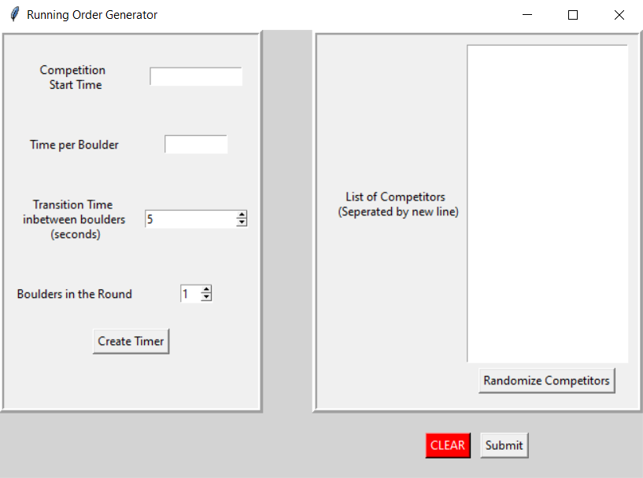
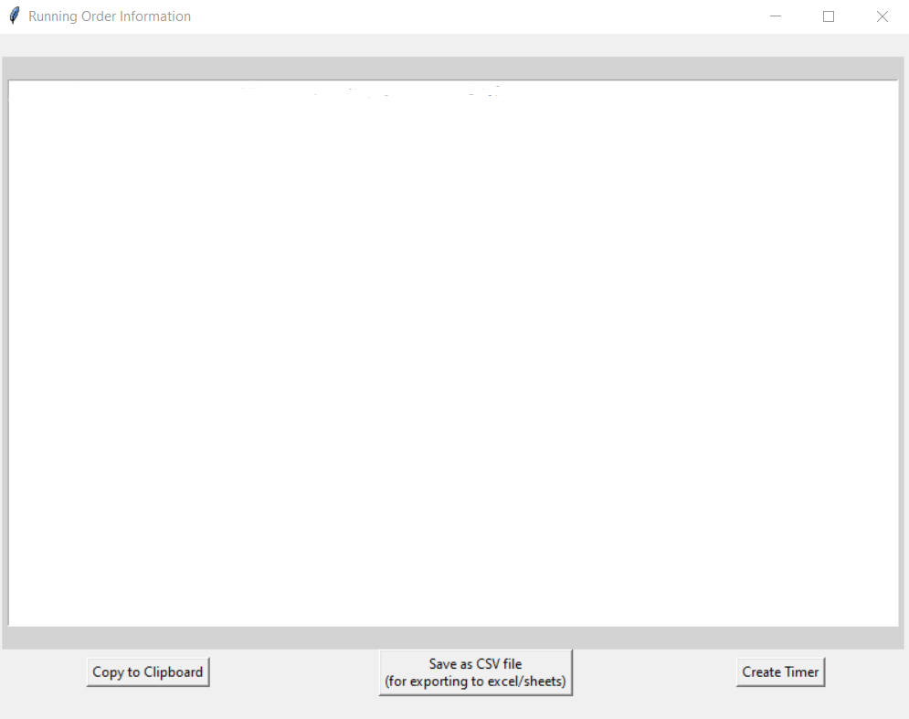
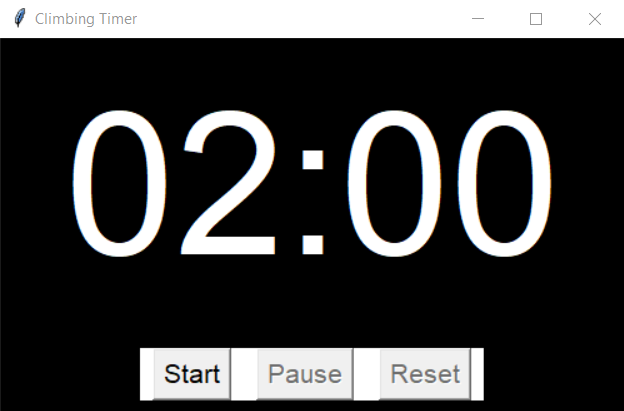
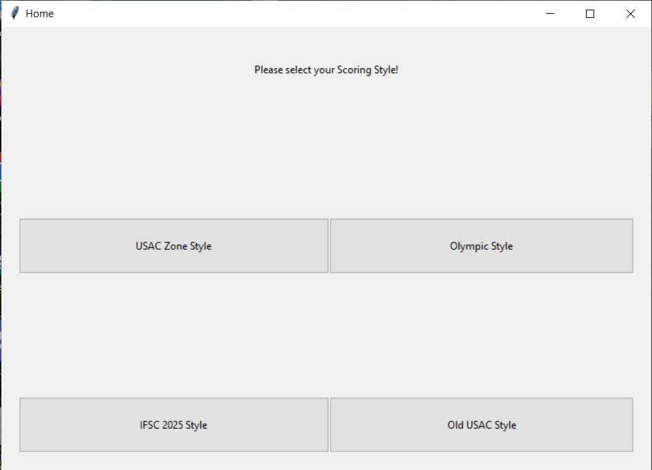
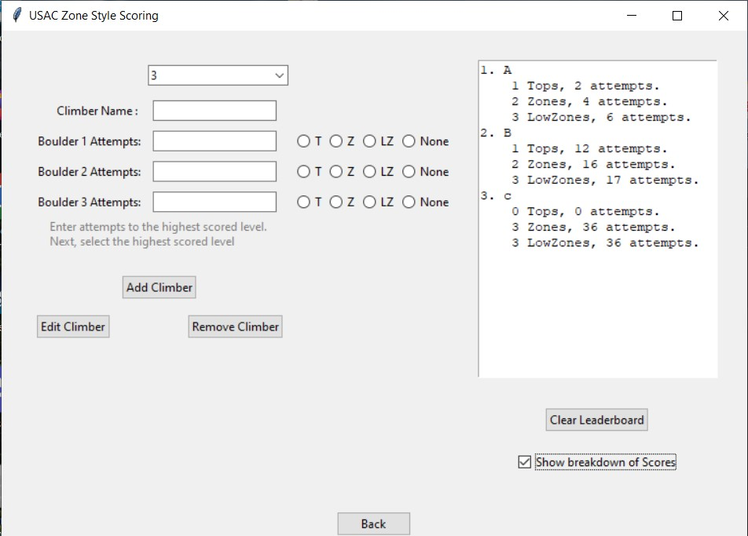
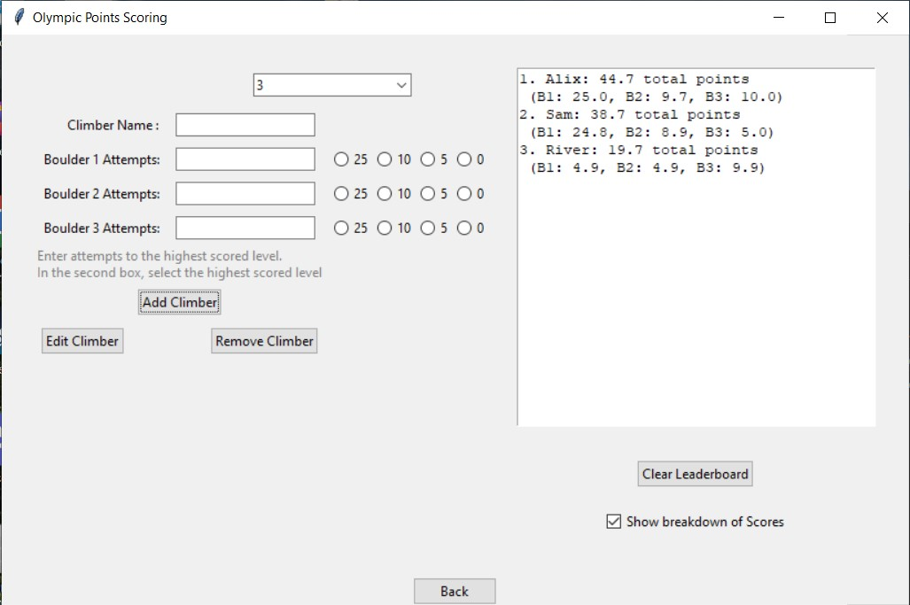
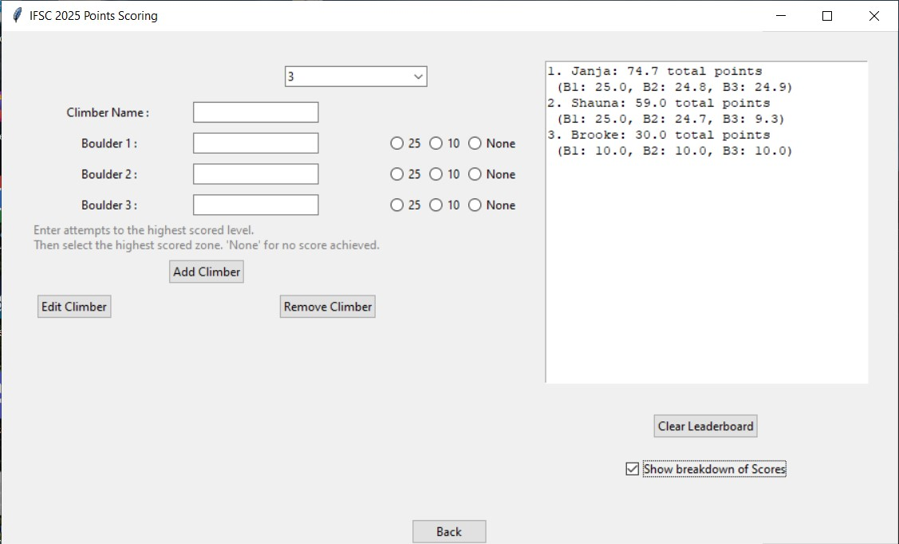

# Running Order

Currently two python based programs (RO_timerapp and RO_scores) to assist in the running of on-sight climbing competitions.

## Installation

Install each application from the GitHub Releases.
* [RO_Scores](https://github.com/garlingz/Onsight-Running-Order/releases/tag/v1.1.0) 
* [RO_timerapp](https://github.com/garlingz/Onsight-Running-Order/releases/tag/v1.0.0)
    
## Authors

- [@garlingz](https://www.github.com/garlingz)

## Features

- Multiple Running Order file formats
- Round Timer with Color/Sounds from official USA Climbing guidelines
- Fullscreen mode
- Cross platform
- Scoring Methods: 
    * USA Climbing (Zone based scoring)
    * Olympic (Scored Levels: 25, 10, and 5 levels)
    * IFSC 2025 (Scored Levels: 25, 10)

## How to Use

### RO_timerapp

##### **Competition Start Time:**
* This box accepts military time in the HH:MM Time format. This time determines when the first climber will being climbing.
##### **Time Per Boulder:**
* The alloted climbing time of the round. USA Climbing default is 4 minutes, written as 4:00. This accepts MM:SS Time format.
##### **Transition Time:**
* How many seconds will be given as a transition period, during this time nobody will be climbing. USA Climbing default is 15 seconds.
##### **Boulders in the Round:**
* How many boulders will each competitor go through in their round. 
##### **List of Competitors:**
* List out Competitor names seperated by a new line. The order of competitors can be randomized using the "Randomize Competitor" button.
##### **Create Timer:**
* Opens the **TimerApp** using **Time per Boulder** and **Transition Time**. This is a shortcut to the timer without needing participants.

After submitting competitors, a new window is opened.

#### Timer App
Timer values will be carried over from the first page.

### RO_Scores
Homepage for the Scores application. Select which scoring method you'd like to use. 

*NOTE: Old USAC Style unavailable at the moment.*

#### USAC Zone Style

**USA Climbing Scoring**
* Zone style scoring where placements are determined by number of tops, zones, low zones, attempts to top, attempts to zone, and attempts to low zone in order of importance.

#### Olympic Style

* Points style scoring where three levels can be scored:
    * achieving a top (worth 25 points)
    * achieving a zone (worth 10 points)
    * achieving a low zone (worth 5 points)
    * zero points awarded if the climber did not reach any scored level.

#### IFSC Style

* Points style scoring where two levels can be scored:
    * achieving a top (worth 25 points)
    * achieving a zone (worth 10 points)
    * zero points awarded if the climber did not reach any scored level.
## License

**RO_Scores** and **RO_timerapp** are licensed under the **Business Source License 1.1 (BSL)**.

-  Non-commercial use is permitted freely.
-  Commercial use requires a separate license.

📅 This software will become open source under the [Apache 2.0 License](https://www.apache.org/licenses/LICENSE-2.0) on **May 13, 2028**.

For commercial use, email **zach.garlinghouse@gmail.com**.

