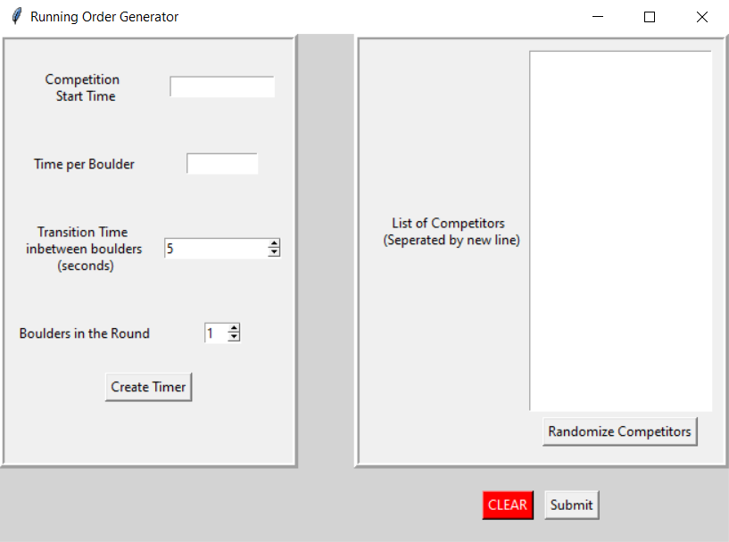
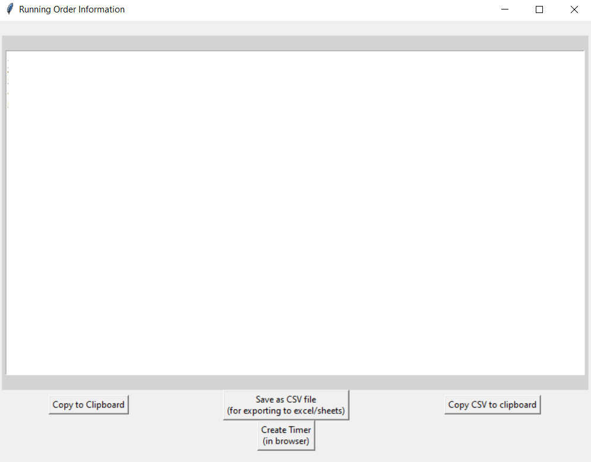
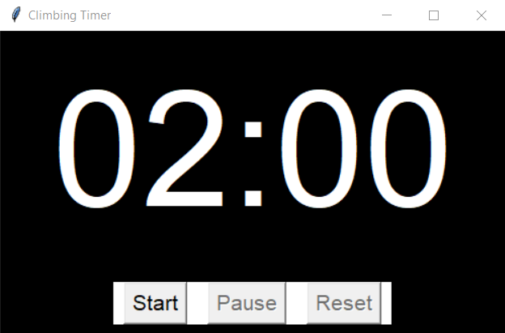

# Running Order Application
RO_app is a python program which lets the user generate "run times" for climbing competitions, specifically on-sight bouldering competitions.

## Installation
File hosted by Git-LFS and should be downloadable from GitHub or by GoogleDrive on request.

## Usage

### Competition Start Time
This box accepts military time in the HH:MM Time format. This time determines when the first climber will being climbing.

### Time per Boulder
The alloted climbing time of the round. USA Climbing default is 4 minutes, written as 4:00. This accepts MM:SS Time format.

### Transition Time inbetween Boulders (seconds)
How many seconds will be given as a transition period, during this time nobody will be climbing. USA Climbing default is 15 seconds.

### Boulders in the Round
How many boulders will each competitor go through in their round.

### List of Competitors
List out Competitor names seperated by a new line. Each competitor in the list will be assigned a chair time, a start time, and an end time.

### Randomize
Shuffles the order of competitiors provided in the Competitor List.

### Clear
The clear button will delete the entries in **Competition Start Time**, **Time per Boulder** and **List of Competitors**. It will retain the information in **Transition Time** and **Boulders in the Round**.

### Submit
Using the information entered, the program will open a new window showing a **Chair Time**, **Start Time** and **End Time**.

### Copy to Clipboard
Copies all text in the field to the clipboard.

### Save as CSV File
Create a Comma Seperated Values file containing the information in the text field. This format is accepted by Excel/Sheets.

### Create Timer
Opens a standalone timer based on user input from the first window.

### Start/Resume
Starts the timer or resumes the timer when paused.

### Stop
Pauses the timer at current time. The timer can be reset or resumed when in the paused state.

### Reset
Resets the timer to the original values for both the climbing time and transition time.

# **<u>Project Goals</u>**
* Learn Object Oriented Programming by using Classes and Functions for project...
* Learn how to make an interactable interface using Python. &#x2705;
* Be able to present project to BP. &#x2705;
* Program should be able to:
    * Have a changeable Start time. &#x2705;
    * Have changable round length &#x2705;
    * Changable transition time (default 5 seconds) &#x2705;
    * Be able to insert break times inbetween categories &#x2705; (manually)
    * <s>Autopopulate categories based on age groups</s>
    * <s>Able to customize age groups, default to USAC </s>
    * Change how many boulders in a round &#x2705;
    * Display start times for each competitor &#x2705;
    * Display start time for each boulder per competitor
    * Toggle to show what time competitor needs to be sitting in chair (1 round before their climb) &#x2705;
    * Be able to randomize order of competitors &#x2705;
    * Columns for each climber:
        * Name, Chair Time, Boulder 1 Start, <s>Boulder 2 Start, Boulder 3 Start, Boulder 4 Start </s>, End Climbing &#x2705;

# **<u>To-Do</u>**
* User interface overhall. Making things more user friendly and pleasant to look at.
* Add functionality to run the TimerApp without using it for a climbing round timer (removed transition sounds).
* Package program to include all dependencies (like the mp3 sound files)
* Pick from a dropdown list which types of notification sounds to use for TimerApp audio.
* Host new application on Git LFS.
* Match color scheme to what USA climbing uses.
* Match sounds to what USA climbing uses.