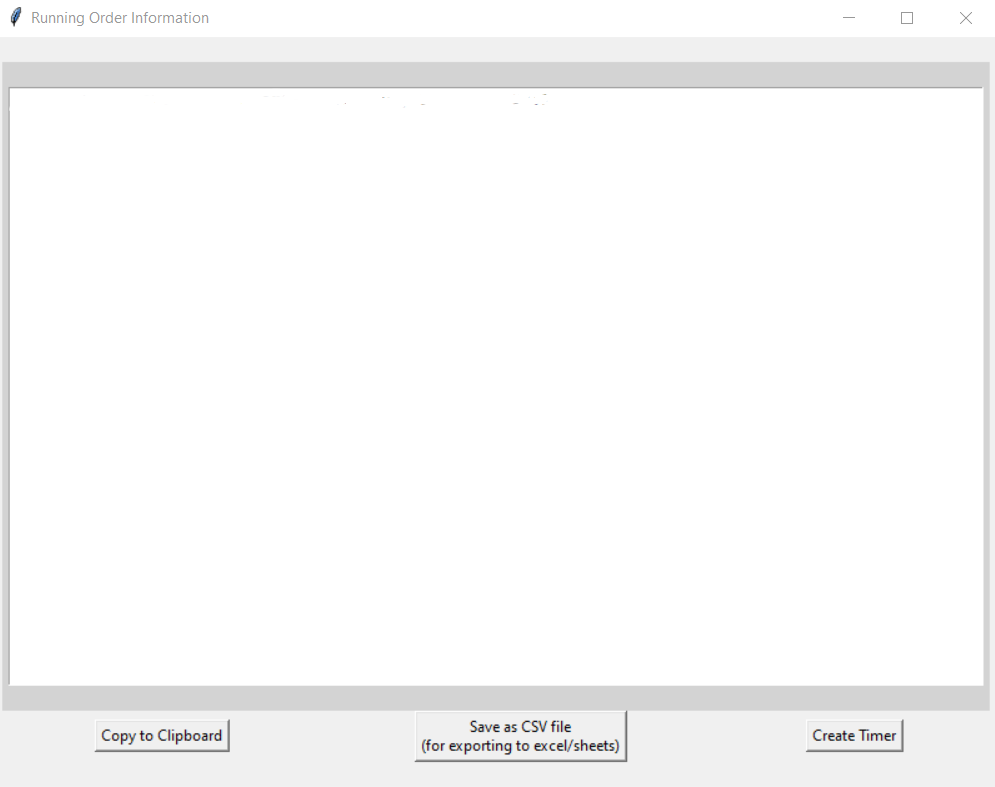
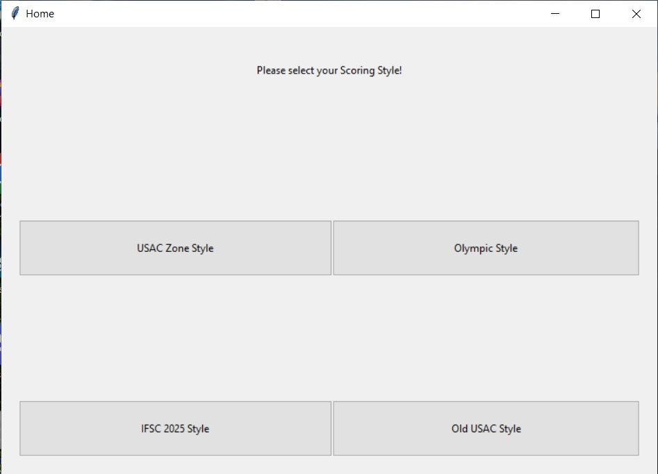
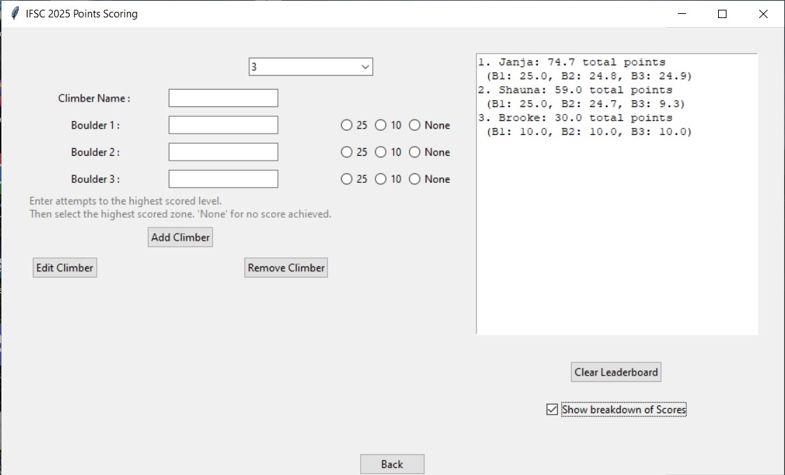

# RO_timerapp

**Competition Start Time:**
* This box accepts military time in the HH:MM Time format. This time determines when the first climber will being climbing.

  
**Time Per Boulder:**
* The alloted climbing time of the round. USA Climbing default is 4 minutes, written as 4:00. This accepts MM:SS Time format.

  
**Transition Time:**
* How many seconds will be given as a transition period, during this time nobody will be climbing. USA Climbing default is 15 seconds.

  
**Boulders in the Round:**
* How many boulders will each competitor go through in their round.

  
 **List of Competitors:**
* List out Competitor names seperated by a new line. The order of competitors can be randomized using the "Randomize Competitor" button.

  
 **Create Timer:**
* Opens the **TimerApp** using **Time per Boulder** and **Transition Time**. This is a shortcut to the timer without needing participants.

  

After submitting competitors, a new window is opened.

## Timer App
Timer values will be carried over from the first page.

### Features
* When the round timer text is $${\color{white}White}$$, it means that this timer is counting down the time of the round.
* When 1 minute remains on climbing time, the text turns to $${\color{red}Red}$$ as well as playing a short beep.
* The last 5 seconds have countdown beeps followed by a higher pitched beep when the round is over.
* Transition time text is in $${\color{green}Green}$$.
* When the transition time is up, a short lower beep followed by a longer higher beep signifies the start of the round.

# RO_Scores
Homepage for the Scores application. Select which scoring method you'd like to use. 

### USAC Zone Style
* Zone style scoring where placements are determined by number of tops, zones, low zones, attempts to top, attempts to zone, and attempts to low zone in order of importance.

  

---

### Olympic Style
* Points style scoring where three levels can be scored:
    * achieving a top (worth 25 points)
    * achieving a zone (worth 10 points)
    * achieving a low zone (worth 5 points)
    * zero points awarded if the climber did not reach any scored level.
 
      

---

### IFSC Style
* Points style scoring where two levels can be scored:
    * achieving a top (worth 25 points)
    * achieving a zone (worth 10 points)
    * zero points awarded if the climber did not reach any scored level.
 
      

---

### Scoring Functionality
#### <ins>Submitting a Climber</ins>
1. Start by selecting the number of boulders you'd like to score.
2. Once the boulder fields have been populated, enter in the number of attempts for each boulder, followed by clicking the radio button which signifies the level achieved.
    *   *(T = Top, Z = Zone, LZ = Low Zone, 0 or None = No level achieved)*
3. Once the information is entered hit Submit. If something was missed or entered incorrectly, an error message will appear telling you your next steps.
***Climber Name*** Field must be filled out to submit, edit, or remove a climber.
#### <ins>Removing a Climber</ins>
Fill out the *Climber Name* field and click *Remove Climber*. Their name and scores will be removed from the leaderboard.
*NOTE: The leaderboard is case sensitive, so you'll need to match it exactly.*.
#### <ins>Editing a Climber</ins>
If you have entered information incorrectly for one of the competitors, you can edit their score by:
1. Entering their name into the *Climber Name* field.
2. Whichever boulder you'd like to change, mark that on the corresponding boulder. **NOTE** If you want the other boulder scores to stay the same, no edits and entries are necessary.
3. Click the Edit Climber button and the leaderboard will update with their new score and placement.
#### <ins>Show breakdown of Scores</ins>
When this box is checked, the scoreboard will update with an explanation of the climbers placement by showing their score breakdown by boulder.
