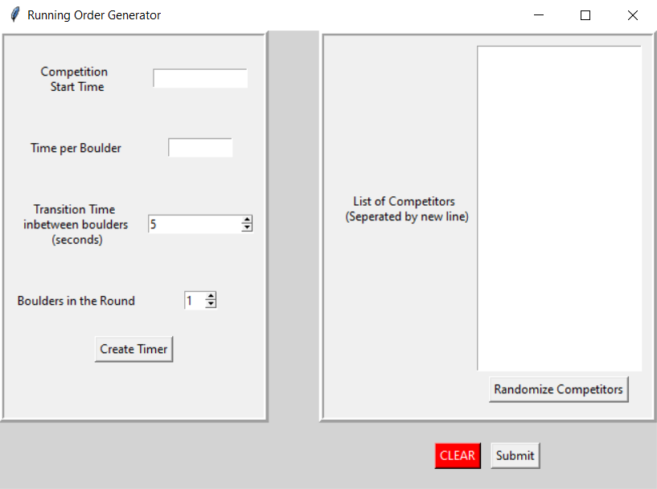
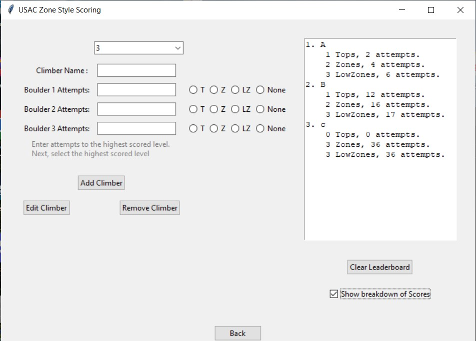
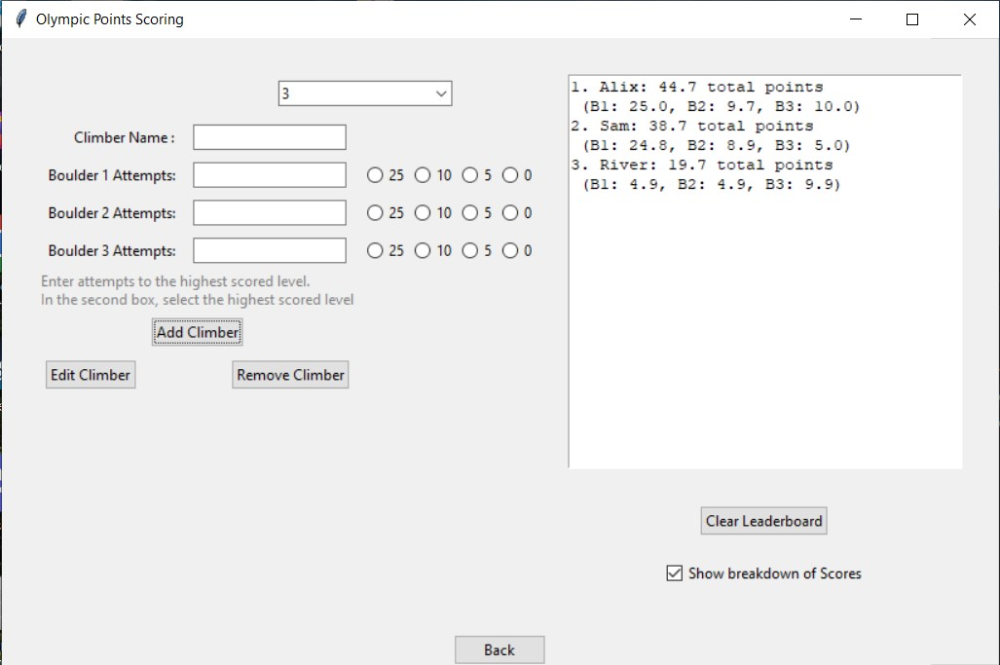

# RO_timerapp

**Competition Start Time:**
* This box accepts military time in the HH:MM Time format. This time determines when the first climber will being climbing.

  
**Time Per Boulder:**
* The alloted climbing time of the round. USA Climbing default is 4 minutes, written as 4:00. This accepts MM:SS Time format.

  
**Transition Time:**
* How many seconds will be given as a transition period, during this time nobody will be climbing. USA Climbing default is 15 seconds.

  
**Boulders in the Round:**
* How many boulders will each competitor go through in their round.

  
 **List of Competitors:**
* List out Competitor names seperated by a new line. The order of competitors can be randomized using the "Randomize Competitor" button.

  
 **Create Timer:**
* Opens the **TimerApp** using **Time per Boulder** and **Transition Time**. This is a shortcut to the timer without needing participants.

  

After submitting competitors, a new window is opened.

## Timer App
Timer values will be carried over from the first page.

## RO_Scores
Homepage for the Scores application. Select which scoring method you'd like to use. 

*NOTE: Old USAC Style unavailable at the moment.*

#### USAC Zone Style

**USA Climbing Scoring**
* Zone style scoring where placements are determined by number of tops, zones, low zones, attempts to top, attempts to zone, and attempts to low zone in order of importance.

#### Olympic Style

* Points style scoring where three levels can be scored:
    * achieving a top (worth 25 points)
    * achieving a zone (worth 10 points)
    * achieving a low zone (worth 5 points)
    * zero points awarded if the climber did not reach any scored level.

#### IFSC Style

* Points style scoring where two levels can be scored:
    * achieving a top (worth 25 points)
    * achieving a zone (worth 10 points)
    * zero points awarded if the climber did not reach any scored level.
